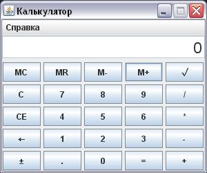
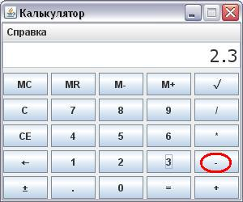
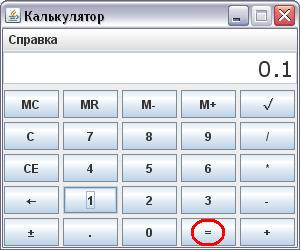
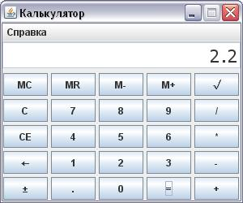

### Калькулятор (Swing)

Выполняет все стандартные действия, в том числе имеет возможность работы с "памятью" (набор кнопок с литерой "M"), удаляет последнюю введенную цифру, удаляет текущее число на экране, сбрасывает все расчеты.

Вводим первое число и нажимаем минус

Вводим втрое число и нажимаем равно

Получаем результат

