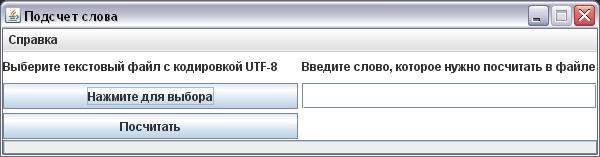

### Подсчет слова в тексте файла (Swing)

Считает сколько раз встречается введенное слово в тексте файла с расширением txt и кодировкой символов UTF-8.

Выбираем файл.

На заднем фоне снимка открыт сам файл,

а также, сколько IDEA нашла в этом файле слово "его" без учета регистра.

Вводим искомое слово специально разным регистром и нажимаем кнопку "посчитать"

Получаем результат

