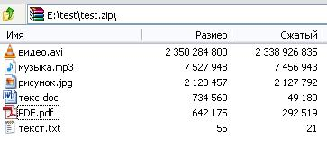

### Информация о файлах в zip-архиве (Swing)

Выводит информацию об имени и размере файлов, находящихся в zip-архиве.

Содержимое zip-архива

Выбираем этот zip-архив

Нажимаем кнопку "показать информацию" и ждем завершения выполнения программы

Получаем результат

