### База счетов. Desktop edition (Swing, JDBC, SQL, Maven)

CRUD приложение на Swing с использованием базы данных PostgreSQL.

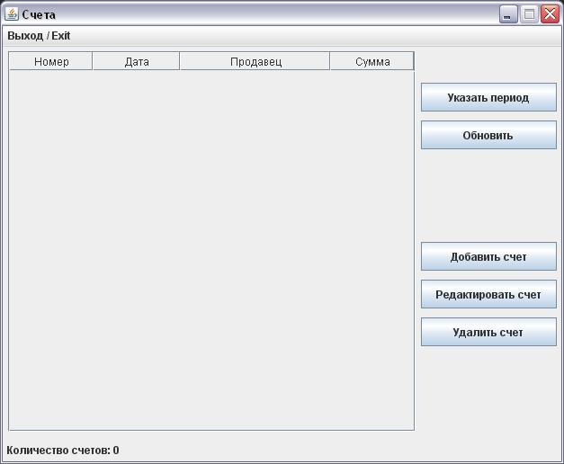

Указываем период, за который необходимо отобразить счета

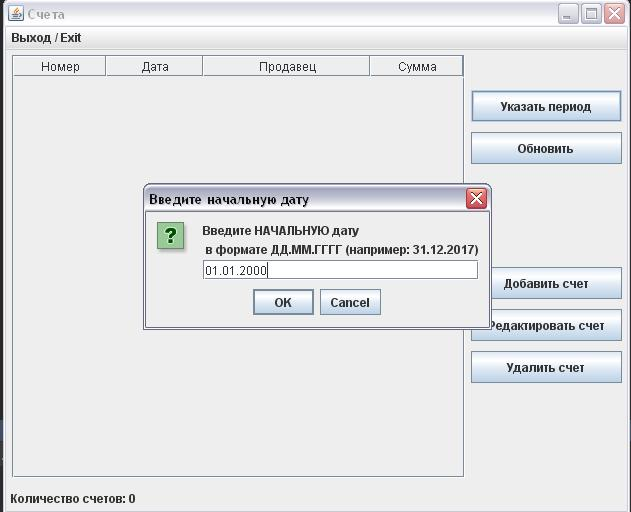

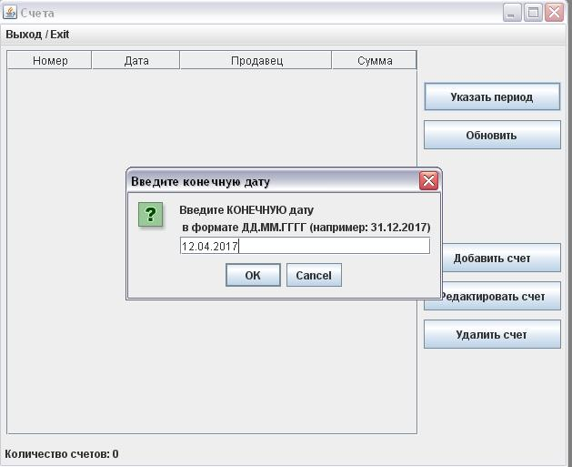

Ожидаем соединения с базой данных и выгрузки самих данных

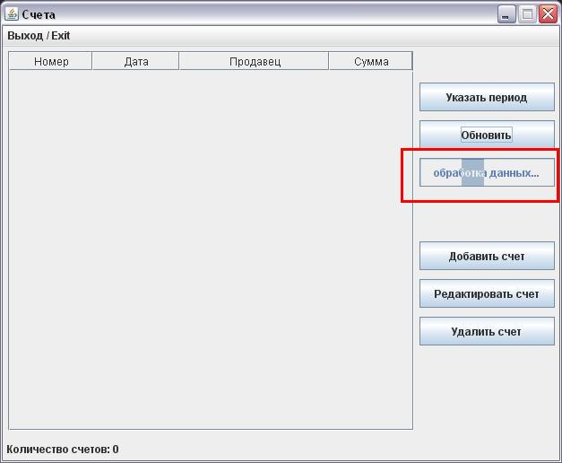

Получаем результат - список счетов

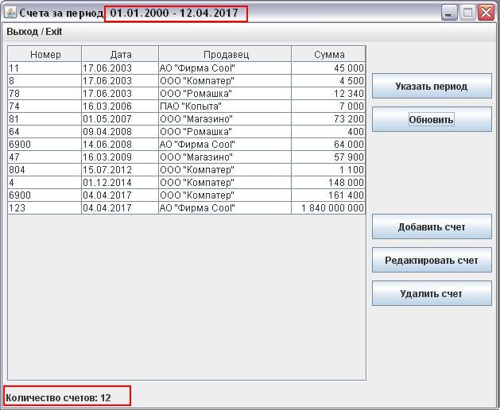

Выделяем необходимый счет и нажимаем кнопку "редактировать"

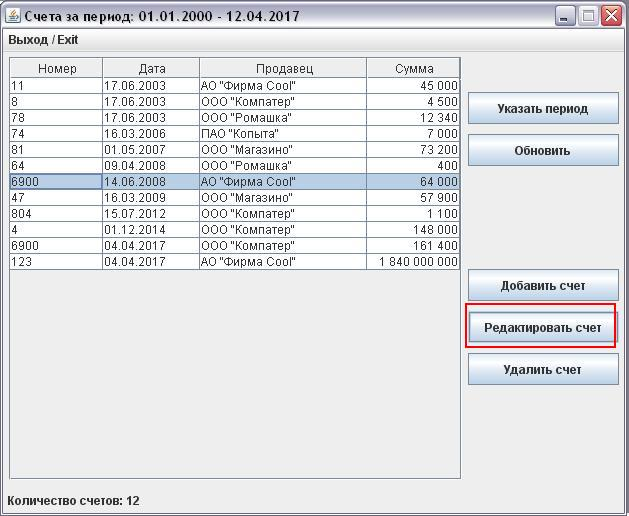

Открывается окно редактирования счета

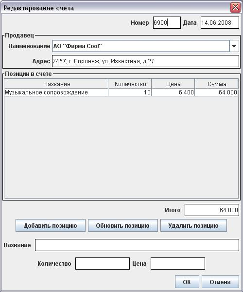

В выпадающем списке предоставлен перечень продавцов (тоже подтягиваются из базы данных)

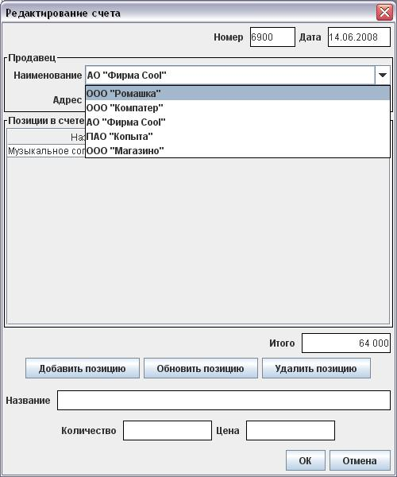

При смене продавца автоматически меняется его адрес

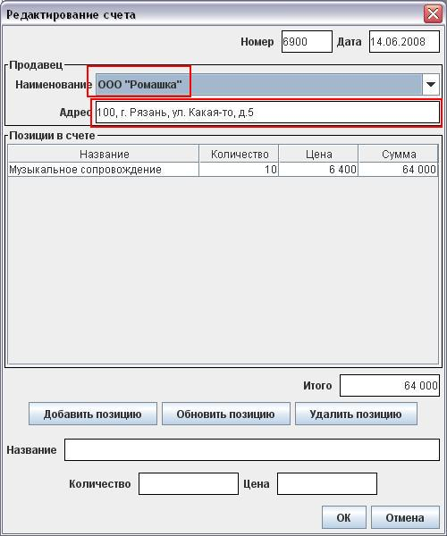

Добавляем позицию в счете

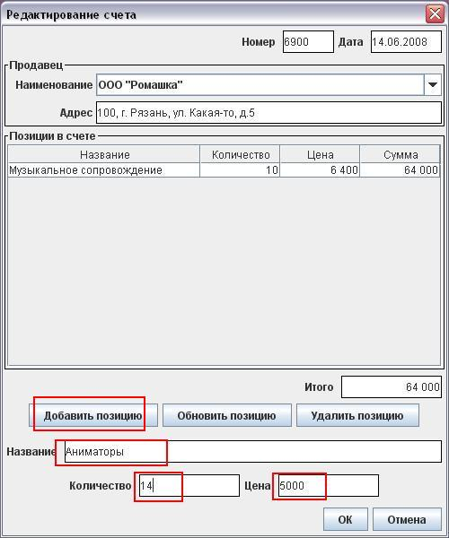

Итоговая сумма по счету изменилась

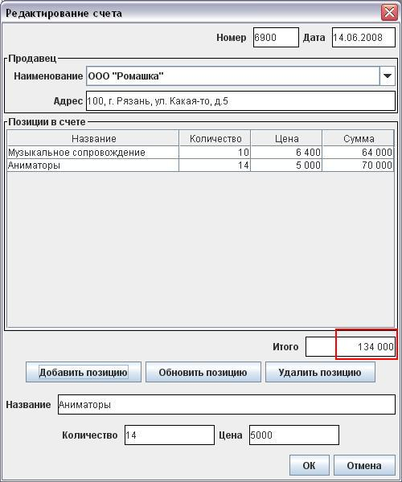

Меняем номер и дату счета и нажимаем кнопку "Ок"

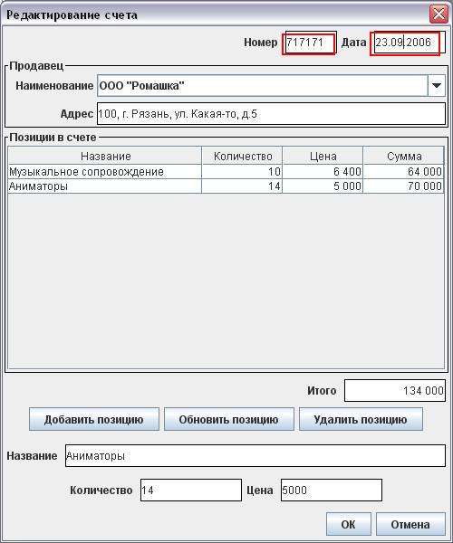

Нажимаем кнопку "обновить" и видим результат предыдущих изменений

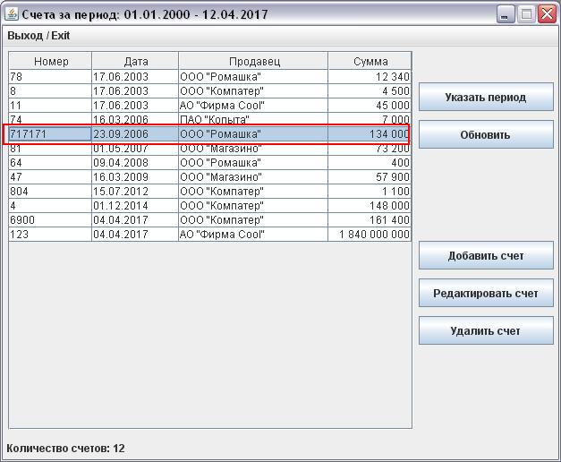

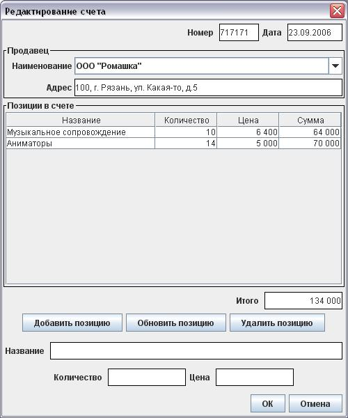

Вернемся к основному меню и нажмем кнопку "добавить счет"

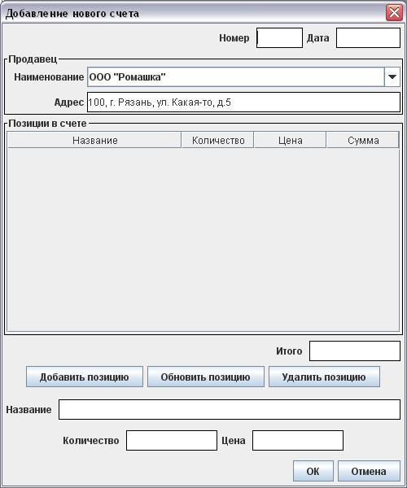

Заполним карточку: номер, дату, продавца, несколько строк в счете.

Случайно добавили строчку с конфетами, надо ее удалить.

Выделяем строку, автоматически проставляются значения в нижней части формы, и нажимаем кнопку "удалить позицию".

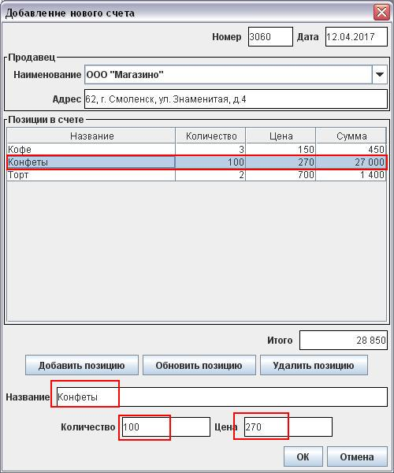

Лишняя строка исчезла, а итоговая сумма изменилась. Нажимаем кнопку "Ok".

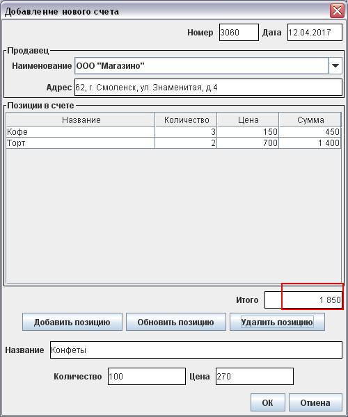

В основном меню нажимаем кнопку "обновить" и видим наш новый добавленный счет

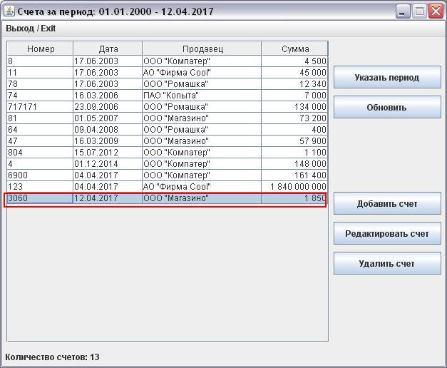

Также чуть выше видим какой-то счет на огромную сумму и вспоминаем, что его надо удалить.

Выделяем его и нажимаем кнопку "удалить".

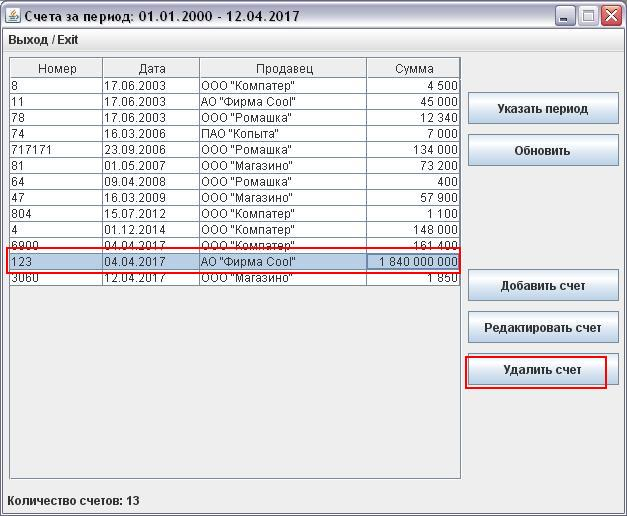

Счет удален

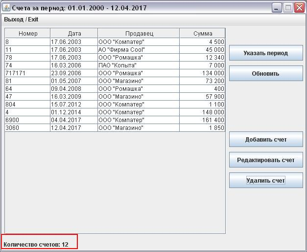
