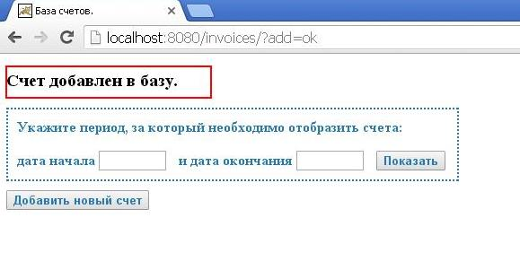

### База счетов. Web edition (Servlets, JSP, JDBC, SQL, HTML, CSS, JavaScript, Maven, Tomcat)

CRUD приложение с использованием web технологий и базы данных PostgreSQL.  
Функционал аналогичен [этой версии](https://github.com/Evgen15/MyFirstProjects/tree/master/InvoicesDesktop), только web.

Указываем период, за который необходимо отобразить счета

Ожидаем соединения с базой данных и выгрузки самих данных

Получаем результат - список счетов

Выделяем необходимый счет и нажимаем кнопку "редактировать"

Открывается страница редактирования счета

В выпадающем списке предоставлен перечень продавцов (тоже подтягиваются из базы данных).  
При смене продавца автоматически меняется его адрес.

Добавляем позицию в счете. Итоговая сумма по счету изменилась

Нажимаем кнопку "Сохранить изменения" и видим сообщение об успешном редактировании счета.

Также предоставлены возможности дальнейшего поиска счетов и добавления нового счета.

Нажмем кнопку "добавить новый счет"
Открывается страница добавления нового счета.

Заполним необходимые поля: номер, дату, продавца, несколько строк в счете.

Нажимаем кнопку "Сохранить изменения" и видим сообщение об успешном сохранении счета.

Попытаемся найти наш новый счет. Нашли.

А теперь выделяем его и удаляем.

Страница автоматически перегрузится, но счетов за указанный период уже не будет

