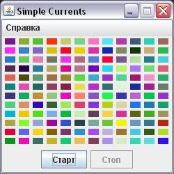
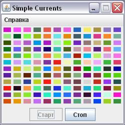

### Простой пример многопоточности (Swing)

Здесь нужно видео, либо gif файл.

После нажатия кнопки "Старт"  ячейки в хаотичном порядке меняют заливку рандомным цветом

После нажатия кнопки "Стоп"  происходит остановка программы

